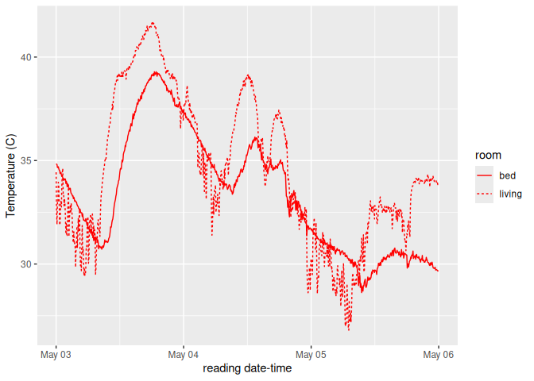
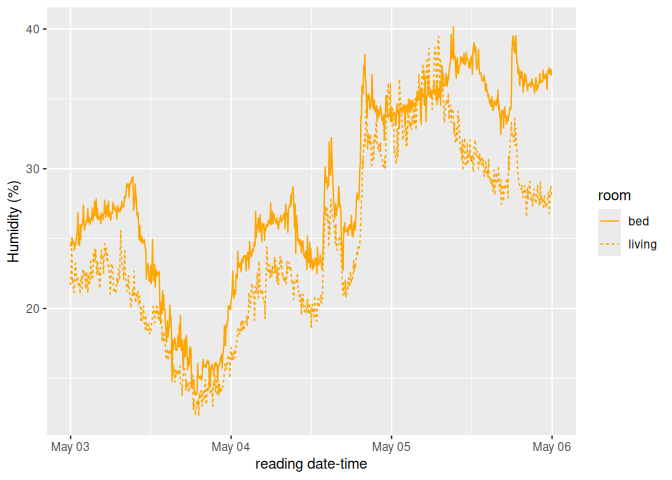
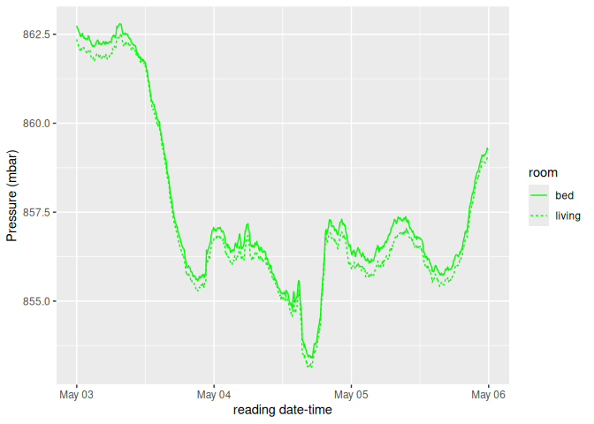
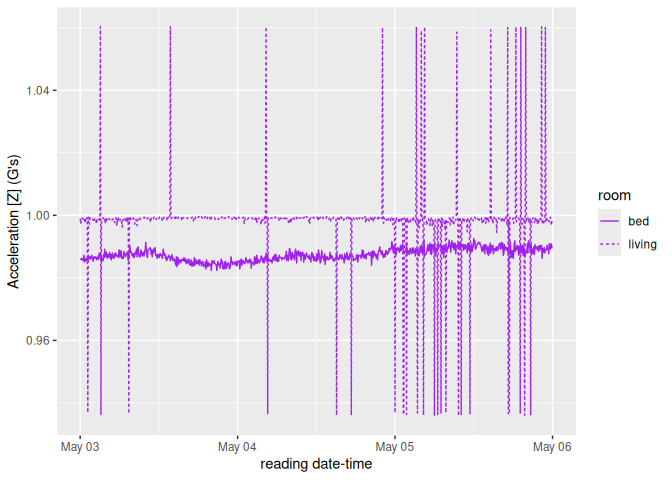

## Apr 27, 2025

The graphs below below are the results the [ambience
database](https://snyderjo.github.io/ambience/).

The idea is to identify any notable differences between the measurements
the pi’s in two different room: my bedroom, and the living room. I’ve
limited the results to those metrics which are of interest. For a
comprehensive and more interactive version of this report [click
here](dailyReport.html)

### Temperature

<!-- -->

Depending on the season, some of you might be asking: *Does it really
get above 40 (104 degrees Fahrenheit) in your bedroom???*  
No. The sensor is attached to a raspberry pi, which produces a good
amount of heat on its own. The above data measures temperature with a
consistent bias.

### Humidity

<!-- -->

### Pressure

<!-- -->

### Acceleration \[z\]

<!-- -->

Note: This should be measuring the vertical acceleration,
i.e. gravity.  
Unless something changes, there’s notable variability around the value
of 1 in the living room. The Bedroom value holds steady around .985
G’s.  
Taken at face value, it means that  
1. Gravity’s effect is slightly lesser in my bedroom than in the rest of
the world, and  
2. Gravity’s value occasionally jumps .06 G’s in my living room.

I’ll chalk these differences up to measurement error.

#### A couple of notes:

- What gives with the delay between the date this report is rendered
  vs. what is displayed above?
  - If the data were immediate, it would be entirely too clear when I
    was out of town–information I’m not keen to share.  
- There are notable gaps in data. Why?
  - Some days the
    [DAG](https://airflow.apache.org/docs/apache-airflow/1.10.9/concepts.html)
    fails for no discernible reason–you might take it up with Apache.  
  - Sometimes, the device itself simply fails to record. ¯\\\_(ツ)\_/¯
